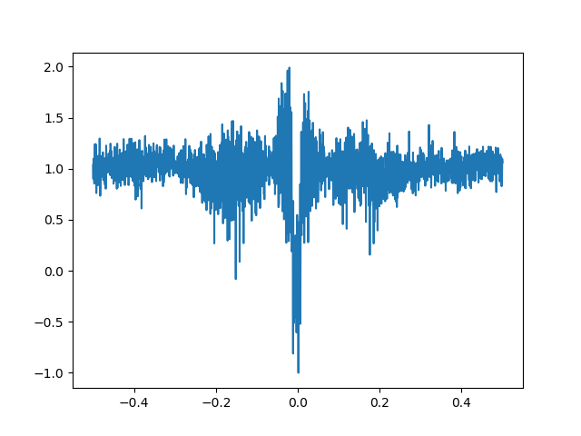
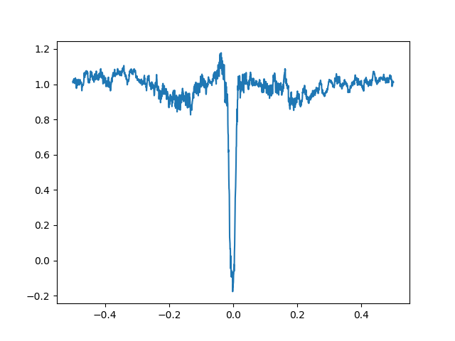

[![Stars][stars-shield]][stars-url]
[![Issues][issues-shield]][issues-url]

# Identifying Exoplanets Using Machine Learning

## Part 1 - Feature Extraction

| Classifier | Results | Reference |
| ---------- | ------- | --------- |
| SVM        | 0.776   | 0.833     |
| KNN        | 0.762   | 0.839     |
| LReg       | 0.777   | 0.845     |

## Part 2 - Deep Learning

| Classifier       | Accuracy | Loss | AUC  | Precision | Recall | F1   |
| ---------------- | -------- | ---- | ---- | --------- | ------ | ---- |
| SVM (Global)     | 0.84     | 5.43 | 0.79 | 0.52      | 0.69   | 0.67 |
| Log.Reg (Global) | 0.85     | 0.47 | 0.79 | 0.53      | 0.64   | 0.67 |
| CNN (Global)     | 0.93     | 0.17 | 0.97 | 0.86      | 0.87   | 0.85 |
| CNN (Local)      | 0.92     | 0.18 | 0.97 | 0.88      | 0.81   | 0.83 |
| MLP (Global)     | 0.87     | 0.28 | 0.92 | 0.70      | 0.86   | 0.76 |
| MLP (Local)      | 0.92     | 0.21 | 0.96 | 0.82      | 0.84   | 0.82 |
| LSTM (Global)    | 0.93     | 0.18 | 0.97 | 0.83      | 0.92   | 0.85 |
| LSTM (Local)     | 0.92     | 0.19 | 0.97 | 0.85      | 0.81   | 0.81 |
| CNN (Dual)       | 0.95     | 0.14 | 0.98 | 0.91      | 0.88   | 0.89 |

## Part 3 - Interprable Machine Learning

# Used Libraries

1. Astropy
2. LightKurve
3. Keras (Tensorflow backend)
4. KerasTuner
5. Sciki-Learn
6. Comet
7. Lime for Time

## References

[1] Abraham Botros, "Artificial Intelligence on the Final Frontier: Using Machine Learning to Find New Earths"

[2] Christopher J. Shallue and Andrew Vanderburg, "Identifying Exoplanets With Deep Learning: A Five Planet Resonant Chainaround Kepler-80 And An Eight Planet Around Kepler-90"

[3] Dinis Marques Firmino, "Exoplanet Transit Detection using Deep Neural Networks"

[stars-shield]: https://img.shields.io/github/stars/DiogorPinheiro/Identifying-Exoplanets-Using-ML
[stars-url]: https://github.com/DiogorPinheiro/Identifying-Exoplanets-Using-ML/stargazers
[issues-shield]: https://img.shields.io/github/issues/DiogorPinheiro/Identifying-Exoplanets-Using-ML
[issues-url]: https://github.com/DiogorPinheiro/Identifying-Exoplanets-Using-ML/issues
