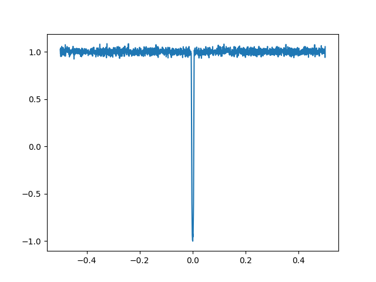
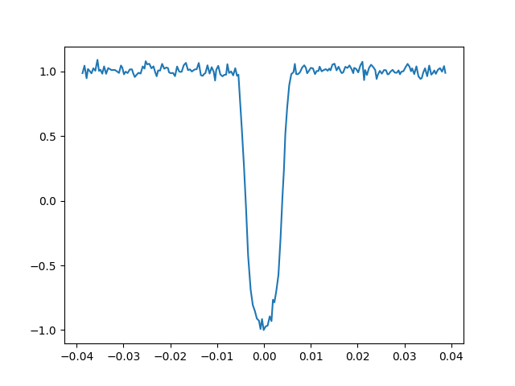

[![Stars][stars-shield]][stars-url]
[![Issues][issues-shield]][issues-url]

# Identifying Exoplanets Using Machine Learning

Final project for the undergraduate degree in Computer Science and Engineering at University of Beira Interior. The development stage of this project is separated in three parts: Feature Extraction, Deep Learning and Model Interpretability.

## Part 1 - Feature Extraction

This part is an adaptation of [1], the final results are presented in the table below.

| Classifier | Results | Reference |
| ---------- | ------- | --------- |
| SVM        | 0.776   | 0.833     |
| KNN        | 0.762   | 0.839     |
| LReg       | 0.777   | 0.845     |

## Part 2 - Deep Learning

There are three major goals for the second part of this project:

1.  Find the best model for 3 different NN architectures (CNN, MLP and LSTM) and the best overall performance;
2.  Compare two types of inputs : Local View and Global View;
3.  Compare between two preprocessing approaches.

### Preprocessing Approaches

Approach 1 : Spline Interpolation, Folding and Binning

Approach 2 : Spline Interpolation, Folding, Binning & Moving Average Filter

|            Approach 1            |              Approach 2              |
| :------------------------------: | :----------------------------------: |
|  |  |

### Global and Local View

Global View - Overall representation of the light curve (2001 bins)

Local View - Representation of a single event in the light curve (201 bins)

|            Global             |            Local             |
| :---------------------------: | :--------------------------: |
|  |  |

### Results

| Classifier       | Accuracy | Loss | AUC  | Precision | Recall | F1   |
| ---------------- | -------- | ---- | ---- | --------- | ------ | ---- |
| SVM (Global)     | 0.84     | 5.43 | 0.79 | 0.52      | 0.69   | 0.67 |
| Log.Reg (Global) | 0.85     | 0.47 | 0.79 | 0.53      | 0.64   | 0.67 |
| CNN (Global)     | 0.93     | 0.17 | 0.97 | 0.86      | 0.87   | 0.85 |
| CNN (Local)      | 0.92     | 0.18 | 0.97 | 0.88      | 0.81   | 0.83 |
| MLP (Global)     | 0.87     | 0.28 | 0.92 | 0.70      | 0.86   | 0.76 |
| MLP (Local)      | 0.92     | 0.21 | 0.96 | 0.82      | 0.84   | 0.82 |
| LSTM (Global)    | 0.93     | 0.18 | 0.97 | 0.83      | 0.92   | 0.85 |
| LSTM (Local)     | 0.92     | 0.19 | 0.97 | 0.85      | 0.81   | 0.81 |
| CNN (Dual)       | 0.95     | 0.14 | 0.98 | 0.91      | 0.88   | 0.89 |

1. Best Overall Performance : Dual CNN
2. Global View provides greater results
3. Significant decrease in model performance when using Approach 2, which means that the so-called noise in the signal turns out to be important for the model prediction

## Part 3 - Interpretable Machine Learning

Coming soon...

# Used Libraries

1. Astropy
2. LightKurve
3. Keras (Tensorflow backend)
4. KerasTuner
5. Sciki-Learn
6. Comet
7. Lime for Time

## References

[1] Abraham Botros, "Artificial Intelligence on the Final Frontier: Using Machine Learning to Find New Earths"

[2] Christopher J. Shallue and Andrew Vanderburg, "Identifying Exoplanets With Deep Learning: A Five Planet Resonant Chainaround Kepler-80 And An Eight Planet Around Kepler-90"

[3] Dinis Marques Firmino, "Exoplanet Transit Detection using Deep Neural Networks"

[stars-shield]: https://img.shields.io/github/stars/DiogorPinheiro/Identifying-Exoplanets-Using-ML
[stars-url]: https://github.com/DiogorPinheiro/Identifying-Exoplanets-Using-ML/stargazers
[issues-shield]: https://img.shields.io/github/issues/DiogorPinheiro/Identifying-Exoplanets-Using-ML
[issues-url]: https://github.com/DiogorPinheiro/Identifying-Exoplanets-Using-ML/issues
